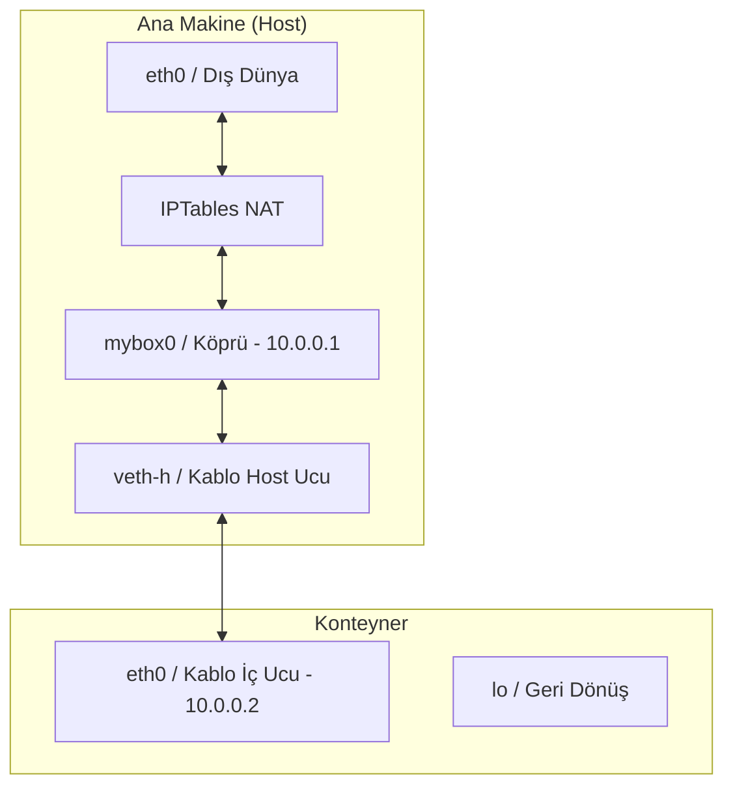

# MyBox Ağ (Networking) Altyapısı ve Kullanım Rehberi

Bu döküman, MyBox projesine eklenen ağ izolasyonu, veth-pair, bridge ve NAT yapılandırmasının teknik detaylarını ve test adımlarını içerir.

## 🏗 Tasarım ve Mimari

MyBox, Docker'ın ağ çalışma mantığını temel alır. Konteyneri ana makineden izole ederken aynı zamanda internete çıkışını sağlar.

### Ağ Şeması



### Temel Bileşenler

1.  **Ağ İzolasyonu (`CLONE_NEWNET`)**: `cmd/runtime/main.go` içinde konteyner başlatılırken ağ yığını tamamen izole edilir.
2.  **Sanal Köprü (`mybox0`)**: Ana makinede `10.0.0.1` IP'si ile oluşturulan bu köprü, tüm konteynerlerin bağlandığı bir sanal switch görevi görür.
3.  **Veth-Pair (Sanal Kablo)**: Bir ucu host tarafında (`veth-h`), diğer ucu konteyner tarafında (`veth-c` -> `eth0`) olan sanal kablo çiftidir.
4.  **Sanal Kablo Temizliği**: Konteynır her başladığında eski ağ arayüzlerini otomatik temizler, "File exists" hatalarını önler.
5.  **NAT (MASQUERADE)**: Konteynerden çıkan paketlerin ana makinenin internet kartı üzerinden dünyaya açılmasını sağlar.
6.  **Volume Mapping (-v)**: Host üzerindeki dizinlerin konteynır içine anlık yansıtılmasını sağlar.

---

## 🛠 Uygulama Detayları

### `internal/network/network.go` Fonksiyonları
*   `SetupBridge`: `mybox0` köprüsünü kurar ve yapılandırır.
*   `CreateVethPair`: Sanal kablo çiftini oluşturur (öncesinde varsa eski olanı siler).
*   `AttachVethToBridge`: Host ucunu köprüye bağlar.
*   `MoveVethToNamespace`: Konteyner ucunu izole alana (PID üzerinden) taşır.
*   `SetupContainerNetwork`: Konteyner içinde IP ve route ayarlarını yapar.
*   `SetupNAT`: `iptables` ve `ip_forward` ayarlarını etkinleştirir.

### `cmd/runtime/main.go` Entegrasyonu
Ağ katmanının çalışması için `cmd/runtime/main.go` üzerinde şu kritik değişiklikler yapılmıştır:

1.  **`CLONE_NEWNET`**: Konteyner başlatılırken ağ izolasyonu bayrağı eklendi.
2.  **Süreç Yönetimi**: Konteyner önce `Start()` ile başlatılır, PID'si alınır, ağ kurulur ve ardından `Wait()` ile beklenir.
4.  **Argüman Ayrıştırma**: `-p` (port) ve `-v` (volume) bayraklarını okuyup ilgili fonksiyonlara ileten mantık eklendi.
5.  **Bind Mount**: `-v` ile gelen dizinleri `chroot` öncesi `mount --bind` ile konteynır kök dizinine bağlar.
6.  **Konteyner İçi Kurulum**: `child()` fonksiyonu içine sanal kablonun hazır olması için bekleme ve ağ kurulumu çağrısı eklendi.

---

## 🚀 Test ve Doğrulama Adımları

Ağı bizzat test etmek için şu adımları izleyin:

### 1. Derleme ve Başlatma
```bash
# Derleme (yeni yapı - cmd/ klasöründen)
go build -o builder ./cmd/builder/
go build -o runtime ./cmd/runtime/

# Çalıştırma
sudo ./builder build ./examples/web-server-demo web-server
sudo ./runtime run ./examples/web-server-demo/web-server.tar -p 8080:80

# Veya derleme yapmadan direkt çalıştırma
sudo go run ./cmd/builder/ build ./examples/web-server-demo web-server
sudo go run ./cmd/runtime/ run ./examples/web-server-demo/web-server.tar -p 8080:80
```

### 2. Konteyner İçi Testler
Konteyner terminali açıldığında şunları kontrol edin:

*   **IP Adresi**: `ip addr` (eth0 -> 10.0.0.2 görmelisiniz)
*   **Köprü Ping**: `ping -c 3 10.0.0.1` (Başarılı olmalı)
*   **İnternet Ping**: `ping -c 3 8.8.8.8` (Başarılı olmalı)
*   **DNS Testi**: `ping -c 3 google.com` (İsim çözümleme testi)

### 3. Ana Makine (Host) Kontrolleri
Yeni bir terminalde altyapıyı inceleyebilirsiniz:
*   **Köprü Durumu**: `ip link show mybox0`
*   **NAT Kuralları**: `sudo iptables -t nat -L POSTROUTING`

---

## 💡 İpuçları ve Notlar

*   **Yetki**: Ağ kartı ve bridge işlemleri için `sudo` zorunludur.
